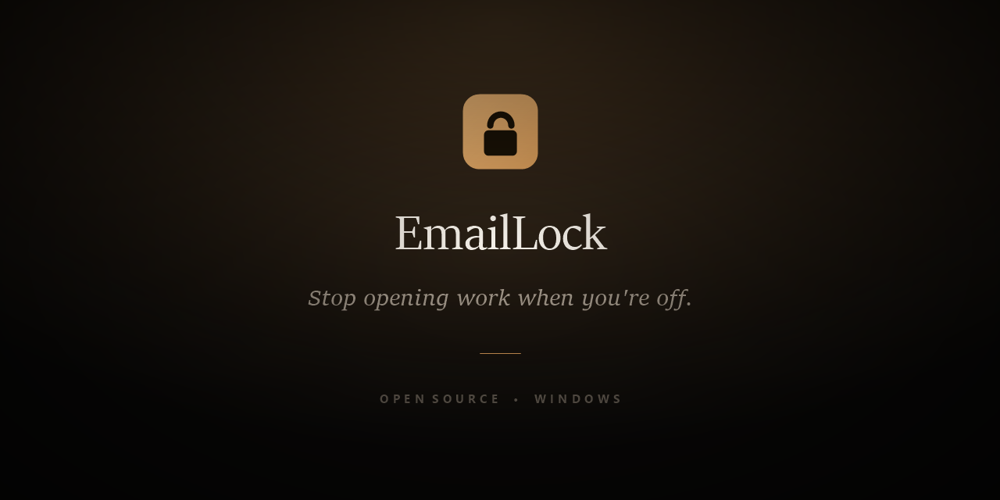
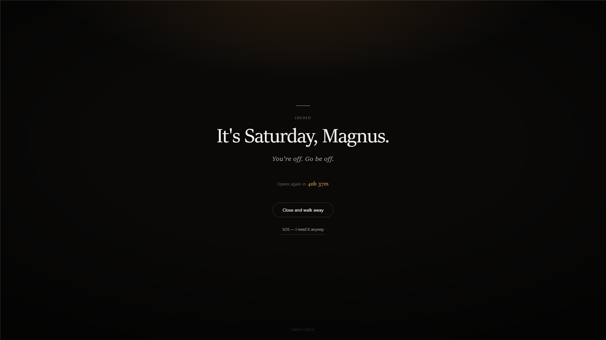
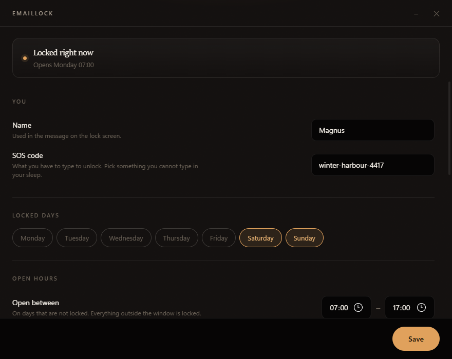

<div align="center">



# EmailLock

### Stop opening work when you're off.

A tiny Windows app that closes your work apps outside the hours you chose —
and reminds you why you're supposed to be off.

[**Download for Windows**](https://github.com/byensitmagnus/emaillock/releases/latest) ·
[How it works](#how-it-works) ·
[Privacy](#privacy--security) ·
[Limitations](#limitations)

[](https://github.com/byensitmagnus/emaillock/actions/workflows/ci.yml)
[](https://github.com/byensitmagnus/emaillock/releases/latest)
[](LICENSE)
[](#install)

</div>

---

You decided Saturday was a day off.

Your hand opened Outlook anyway.

EmailLock closes it and puts this on your screen instead:

<div align="center">

</div>

The countdown tells you exactly how long you have off. If you genuinely need to work,
SOS asks for your code and unlocks everything for an hour.

On a weekday inside your working hours, nothing happens at all.

<div align="center">

</div>

## Install

**Windows 10 or 11.**

1. [Download the latest installer](https://github.com/byensitmagnus/emaillock/releases/latest)
2. Run it — no admin rights, no UAC prompt, it installs for your user only
3. Pick your off-hours and set an SOS code
4. Leave **Start with Windows** ticked, and forget about it

There is no .NET to install first; the runtime is bundled. On Windows 10 the installer
fetches Microsoft Edge WebView2 if your machine doesn't already have it. Windows 11 always
does.

> **The installer is not code-signed.** Windows SmartScreen will likely show
> *"Windows protected your PC"* the first time you run it. That is what an unsigned
> installer from a small open-source project looks like — it is not a claim that the file
> is safe, so if you'd rather not trust it, [build it from source](#build-from-source)
> instead. A signing certificate is on the [roadmap](docs/roadmap.md).

Uninstall from Settings → Apps like anything else. Your config file is left alone.

## Why I built this

Running a company makes it very easy to turn every evening and weekend into work.

You can decide, genuinely and out loud, *"I am not working today"* — and then five minutes
later find yourself reading email, having never made a decision to start working. The app
was open before the thought was.

That's the whole problem. Not discipline, not workload. A reflex that fires faster than the
intention that was supposed to stop it.

EmailLock exists to put about four seconds between the reflex and the inbox. Four seconds is
enough to ask the actual question:

**Do I need to work right now?**

Usually the answer is no. You just needed to be asked.

Sometimes the person breaking your work-life boundaries is you.

## How it works

EmailLock sits in the tray and checks once a second whether you're inside a locked window.
If you are, and one of your listed apps is running, it asks that app to close and shows the
lock screen.

That's the entire mechanism. There is nothing else.

- Nothing is installed into Outlook. No plugin, no add-in, no COM hook.
- No driver, no Windows service, no scheduled task, no group policy.
- No admin rights at any point.
- Your apps get a normal close request first, so they can prompt to save.

## This is friction, not a prison

Task Manager can end EmailLock in about six seconds. That is intentional and it will not be
fixed.

Making it unkillable would mean a service, a watchdog, admin rights and a driver — and it
would change what the thing *is*. Software that stops you from doing something you have
consciously decided to do is a different product with a different name, and it is usually
called employee monitoring.

**EmailLock isn't trying to defeat a determined version of you. It's trying to interrupt the
automatic version of you.**

The determined version can always get through. It just has to be determined — which means
deciding, which was the entire point.

Two consequences worth knowing:

- **This is software you install on yourself, for yourself.** It is not built for employers,
  it has no reporting, no admin console and no way to see what someone else did.
- **Quit is disabled during a locked hour.** During your open hours you can quit from the
  tray menu whenever you like. That is friction, not a lock — Task Manager still wins.

## Features

- **Locked days** — chosen days are locked around the clock. Defaults to Saturday and Sunday.
- **Open hours** — on every other day, only your chosen window is open. Everything outside
  it, including the evening and the small hours, is locked.
- **Any app, not just Outlook** — it works on process names. `OUTLOOK` is classic Outlook,
  `olk` is new Outlook. Add Teams, Slack, Thunderbird, or whatever pulls you back in.
- **Live countdown** — the lock screen shows exactly when you're allowed back.
- **SOS** — type your code to unlock everything for a set number of minutes.
- **Speaks your language** — Danish on a Danish Windows, English everywhere else.
- **Fails closed** — a config it cannot understand leaves you locked, never unlocked.

<div align="center">

</div>

## Configuration

Double-click the tray icon, or right-click → **Settings**.

| Setting | What it does |
|---|---|
| **Name** | Goes into the message on the lock screen. |
| **SOS code** | What you type to unlock. Pick something you *cannot* type in your sleep. Your birth date is ten keystrokes you already know, which is barely any friction at all — a long random string written on paper in a drawer is real friction. |
| **Locked days** | Locked around the clock. |
| **Open hours** | Your working window on days that aren't locked. It does not cross midnight — everything outside it is locked. |
| **Apps** | Process names without `.exe`. |
| **SOS unlocks for** | Minutes before it locks itself again. |
| **Grace before force-close** | Your app is asked to close politely first so it can prompt to save drafts. It is force-closed only after this many seconds. |
| **Message** | First line is the headline, the rest is the subtitle. `{day}`, `{time}` and `{owner}` are substituted. |

Settings live in `%APPDATA%\EmailLock\config.json`. You can edit that file by hand; anything
unusable in it leaves the app **locked** and opens Settings to tell you exactly what's wrong.

## Privacy & security

Everything below is a statement about the code in this repository, which you can read.

- **No telemetry. No analytics. No accounts. No cloud dashboard.**
- **EmailLock makes no network requests.** There is no HTTP client in the application at
  all. The two screens are local HTML files with their CSS and JavaScript inline and no
  external resources of any kind.
- **No admin rights.** The installer is per-user. The only thing ever written outside the
  app's own folders is one `HKEY_CURRENT_USER` Run entry, and only if you tick *Start with
  Windows*.
- **Your settings never leave your machine.** They are a plain JSON file in
  `%APPDATA%\EmailLock\`. Your SOS code is stored in it in plain text — it is friction, not
  a password, and it protects nothing but your own intentions.
- **Outlook is not modified.** EmailLock has no add-in, no COM registration and no access to
  your mail, accounts, credentials or message content. It knows only that a process with a
  given name is running.
- **No drivers, no services, no scheduled tasks, no hooks into other processes.**
- **WebView2** is used purely to render the two screens, which are loaded from strings in
  the executable rather than from any URL. DevTools, browser shortcuts and the context menu
  are disabled. WebView2 is a Microsoft component already present on Windows 11; like the
  rest of Windows, it updates itself independently of this app.
- **What gets force-closed:** only the process names you listed, and only during your locked
  hours. Each one gets a normal close request first and is force-closed only after your
  grace period.

**The one network request in the project** is in the installer: if Microsoft Edge WebView2 is
missing, it downloads Microsoft's official WebView2 bootstrapper from `microsoft.com`. If
WebView2 is already installed — as it is on every Windows 11 machine — nothing is downloaded.
The relevant lines are in [`installer/EmailLock.iss`](installer/EmailLock.iss).

## Limitations

These are design boundaries, not bugs to report.

- **Task Manager beats it.** [On purpose.](#this-is-friction-not-a-prison)
- **Webmail in a browser is not covered.** Closing `OUTLOOK.EXE` does nothing about
  `outlook.office.com` in a tab. This is the biggest real gap and it's the top item on the
  [roadmap](docs/roadmap.md).
- **It polls once a second**, so an app can flash on screen for up to a second before it
  closes. The interruption is the point, not the milliseconds.
- **Force-closing carries a risk.** An app that refuses a normal close — sitting on an
  unanswered *"save changes?"* prompt, for instance — will be force-closed when the grace
  period runs out, and can lose the last edits. Raise the grace period if that ever bites
  you.
- **Windows only.** It uses Windows APIs directly and there is no macOS or Linux port.

## Build from source

Needs the [.NET 8 SDK](https://dotnet.microsoft.com/download/dotnet/8.0). The installer also
needs [Inno Setup 6](https://jrsoftware.org/isinfo.php)
(`winget install JRSoftware.InnoSetup`).

```powershell
./build.ps1                 # tests, self-contained publish, installer in dist/
./build.ps1 -SkipInstaller  # just the app
dotnet test                 # tests only
```

`build.ps1` refuses to produce a release from a failing test run.

### Architecture

```
src/EmailLock/Schedule.cs    when you are locked, and when it lifts — pure, no clock of its own
src/EmailLock/Config.cs      settings, validation, SOS comparison
src/EmailLock/Program.cs     tray icon, the once-a-second loop, window wiring
src/EmailLock/WebWindow.cs   borderless WebView2 host + the JS bridge
src/EmailLock/ui/            the two screens, as HTML — this is where the design lives
tests/                       xUnit
installer/                   Inno Setup script
```

The UI is HTML in WebView2 rather than hand-placed WinForms controls, which is why the design
lives in `ui/` and can be changed without touching C#.

Two decisions worth knowing before you change anything:

- **`Schedule` and `Config` are pure.** `now` is always passed in, so every branch is
  reachable from a test without waiting for a Sunday.
- **Validation returns keys, not prose.** `Config.Validate()` names what's wrong
  (`backwardsWindow`) and the UI layer turns that into a sentence in the user's language.
  The tests therefore pass on a Danish machine and an English one alike.

## Contributing

Pull requests and issues are welcome.

**This project is maintained on a best-effort basis. There is no support SLA.** It exists to
help its maintainer work less, so it will never grow a Discord, a newsletter or a support
inbox. If that means a PR sits for a while, fork it — that's what the licence is for.

See [CONTRIBUTING.md](CONTRIBUTING.md) for the principles a change should respect.

## Roadmap

[docs/roadmap.md](docs/roadmap.md) — what's being considered, what has been deliberately
rejected, and the honest holes in the current design.

## License

[MIT](LICENSE).
